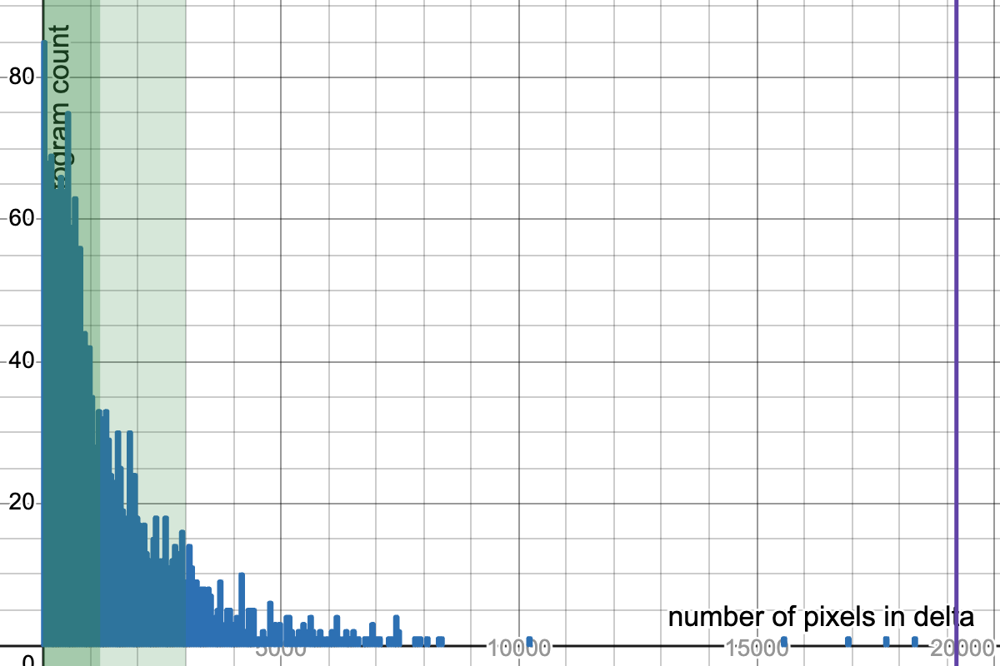

# pd-usb-uvc

A full UVC webcam implementation running entirely on the Raspberry Pi Pico.

This project turns a Pico (RP2040/RP2350) into a functioning USB webcam that plays a compressed 160x120 video at roughly 9–10 FPS. It uses a custom bitpacked/XOR-diff video format, a lightweight streaming decoder, and a highly optimized renderer that pushes CircuitPython to its limits. If you want to stream arbitrary video over USB from a microcontroller, this repo shows exactly how to make it work.

https://github.com/user-attachments/assets/c71bba60-4e2d-45cc-b5af-98f38747aaaa

## Why This Exists

CircuitPython's `usb_video` module is barely documented and has exactly one other working example on GitHub (which throws type errors). This project serves as:

1. A complete, working reference implementation
2. Documentation of platform quirks and workarounds
3. Proof that USB webcam emulation is possible on the Pico
4. A collection of performance optimizations for constrained environments

If you're trying to use `usb_video` in your own project, this codebase may be the most complete resource available.

A minimal working example can be found in [`uvc-tests-src/`](uvc-tests-src)

Also, I thought it'd be fun.

## Technical details

### File format

The foremost constraints are those of storage space and compute power. I downscaled the video significantly. When storing the file, I store one initial keyframe and the rest as XOR diffs (since this is a binary video). Since this is a binary video, I can also store eight pixel values in one byte. Read more about the format of `crushed_frames.bin` at [format-spec.md](format-spec.md). I originally didn't store xor diffs and instead just had a series of bitpacked frames, but I ended up storing the diffs after realizing that _FrameBuffer doesn't allow slice assignment and makes you assign pixels one at a time_. Especially since I'm in circuitpython, the goal is to do as little as possible on the pico itself.

The pico reads the file in a streaming manner so as to not hold all of it in memory. (Although I ended up getting OOM anyways: the solution was to occasionally close and reopen the file and then `.seek()` to the last location to pick back up where it left off)

I later improved further upon this. Most bad apple frames have small deltas, but a few (scene changes), have very large deltas. In this case, it's more efficient to store these as keyframes, since you get 16x compression when bitpacking as opposed to needing to store each changed pixel as two bytes. I implemented a simple heuristic and frame header to allow for this. The threshold can be tuned; ultimately, it's a tradeoff between storage space and decoding speed. If your pico has more space, then by all means, increase the keyframe threshold.

FrameBuffer expects pixel values to be in the "RGB 565 Swapped" pixel format. Who knows what that means? Luckily, pretty much universally black is all `0x0000`s and white is all `0xffff`s. At one point I tried to fill the screen with magenta and it turned out green so ¯\\\_(ツ)\_/¯ (I think I swapped it one too many times in the end. Working code that produces magenta is in `uvc-tests-src/`).

See the code in action! Parsing and preparation is done in [gen_compressed.py](gen_compressed.py) while decoding and streaming is in [pd-src/code.py](pd-src/code.py)

### On documentation and bugs.

The second (and more daunting) problem that only revealed itself later was the severe lack of documentation or even [usage](https://github.com/search?q=%22import+usb_video%22+language%3APython+path%3A*.py+NOT+%22thonny%22&type=code) of this module. I guess it's a pretty esoteric use case, but still, I'm surprised that literally only one other person thought to use `usb_video` on the pico and publish it on Github. (the implementation of which throws type errors, by the way. So this is the only working implementation, as far as I can tell). [The documentation](https://docs.circuitpython.org/en/latest/shared-bindings/usb_video/index.html) is a stub. Lots of random issues like how it just doesn't work on Windows, or that the api exposes a `bytebuffer` that is 4\*width\*height bytes but only has `len()` of width \* height because each item is a 16-bit word. Or that `display.refresh()` and `fb.refresh()` are distinct and both need to be called. So hopefully this can be a resource to others.

### Deploying on the edge.

> _The hard part of coding isn't the code; it's everything else_

This project shows why.

The statement couldn't be more true in the case of this project. Quite literally a 20% implementation, 80% troubleshooting time breakdown. Especially because half of the time there was no error, so I had to troubleshoot and guess blindly a bit. _(Screen enumerates but is all black? weird. Video streams but only when you reload the serial monitor is closed and reopened? cursed.)_ Even more so, this was built entirely via proxy testing with volunteers. So thank you to all the volunteers who helped test this out. I truly appreciate your help.

## Performance Deep Dive

### The Interpreter Overhead Problem

CircuitPython on the RP2040 runs at an effective **1.13 MHz**. Despite the chip running at 133 MHz, the Python interpreter adds ~118x overhead. Benchmarking shows:

- **Native ARM performance:** 133 million instructions/second
- **CircuitPython performance:** ~1.1 million Python operations/second
- **Effective speed:** Comparable to a 1982 Commodore 64

Of course, the real solution is to write your code in C for a literal 100x speedup. Interpreted circuitpython on a microcontroller under performance constraints is kind of ridiculous. But constraints breed creativity. Plus, it's a pain to reflash every time.

### Loop Unrolling: A 1970s Technique in 2025

The biggest bottleneck was keyframe rendering - processing all 19,200 pixels. Approximately 2/5 of frames are determined to be keyframes (optimized for file size). This means lag and frame skipping 2/5 of the time.

Solution: Manual 4x loop unrolling (processing four bytes at a time) reduced loop iterations by 75%, yielding a **1.31x speedup**. This single optimization took keyframe rendering from ~180ms to ~137ms, making 10 FPS feasible(-ish).

### Frame Timings

Real measurements on RP2040:

- **Keyframes:** 135-140ms (copies all pixels)
- **Delta frames:** 4-59ms (varies depending on size of delta)
- **Target:** 100ms per frame (10 FPS)

With 25% keyframe rate, we achieve ~9 FPS average with occasional stutters on keyframes. More loop unrolling would lead to exponential diminishing returns; you're not going to notice -2.5ms on 115ms keyframes.

Run it at 7fps if you don't like the stutters, I guess.

## File size vs decoding speed tradeoff

Using a keyframe threshold of 1200 pixels optimizes for file size (1200 \* 16=19200 :: 16:1 ratio of bits / pixel in bitpacked keyframes vs deltas). But if you have a 2000-pixel delta, then you're wasting cycles redrawing all 19,200 pixels to the buffer. Increasing this threshold to 3000 increases file size 25% but greatly reduces keyframe density, resulting in fewer laggy frames.

## Installation

_has been tested on RP2350 and Xiao RP2040!_

> [!NOTE]
> USB UVC on the Pico does not work on Windows! This is an issue with the underlying library / how Windows deals with composite devices and is not something I am able to fix.

(requires a Pico of course, or any [compatible circuitpython-enabled board](readme/compatible_boards.txt))

Make sure file size of crushed_frames.bin is small enough to fit on your board. You might have to decrease FRAMES in `gen_compressed.py`

1. Install CircuitPython for your board
2. Double click `install.command` OR

   a. Copy pd-src/crushed_frames.bin to CIRCUITPY

   b. Copy pd-src/\* to CIRCUITPY

3. Unplug/replug the board (important!)
4. Check /dev/video\* or use ffplay

## Hacking

Swap out badapple.mp4 for a video file of your choosing, update `prepare.sh`, and run `prepare.sh` to use a different video

## Licensing

See LICENSE
